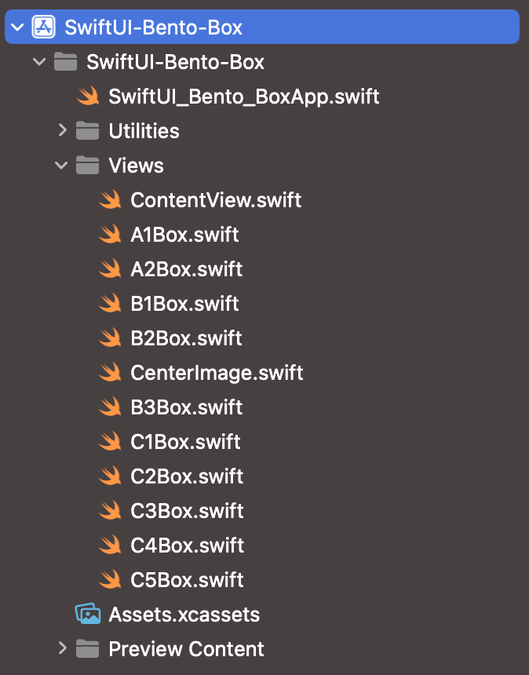
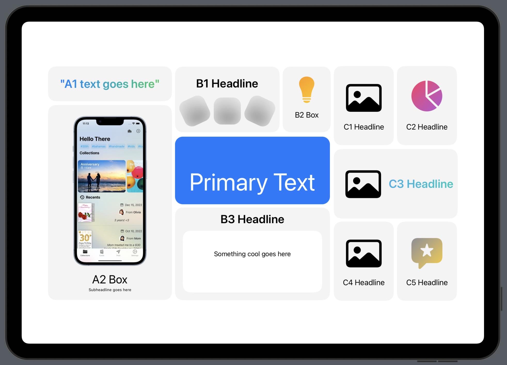

# SwiftUI Bento Box

#### Create your own SwiftUI Bento Box to market your app's features!

I originally created this for [Hello There](https://apple.co/3TWTeey) and thought it would be fun to share it with the iOS Developer community. 

## A Few Notes
• Works best with a landscape iPad Pro preview  
• I've set up the project to be in 3 columns: A, B, and C. Views correspond to their relative placements in preview  
• The template uses image placeholders -- you'll need to provide your own content  
• This project was created using Xcode 15 beta 6  

#### Each block is its own view

Feel free to fork and play around with the layout. I'd love to see what you create!  
Ping me on Twitter: [@thatvirtualboy](https://twitter.com/thatvirtualboy) // Mastodon: [@thatvirtualboy](https://techhub.social/@thatvirtualboy)  

