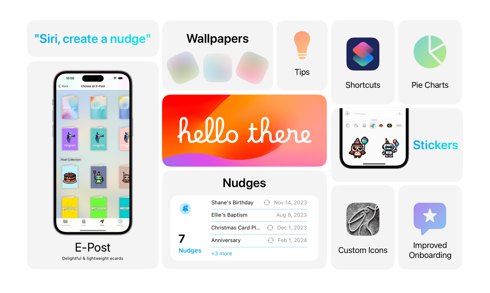

# SwiftUI Bento Box
Create your own SwiftUI Bento Box to market your app's features!

I originally created this for [Hello There](https://hellothereapp.us) and thought it would be fun to share it with the iOS Developer community. 

## A Few Notes
• Works best with a landscape iPad Pro preview  
• I've set up the project to be in 3 columns: A, B, and C. Comparing the *Views* hierachy along with the preview should help explain  
• The template uses image placeholders -- you'll need to provide your own content
• This project was created using Xcode 15 beta 6  
